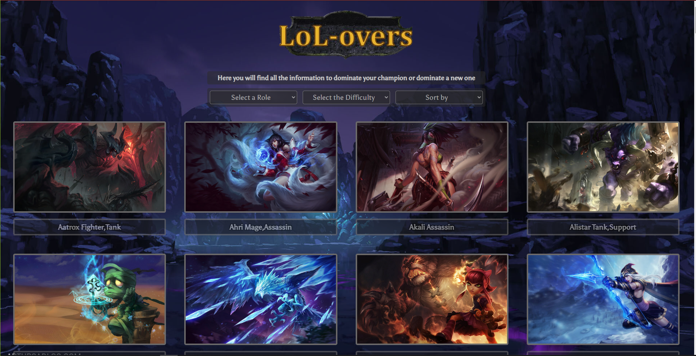
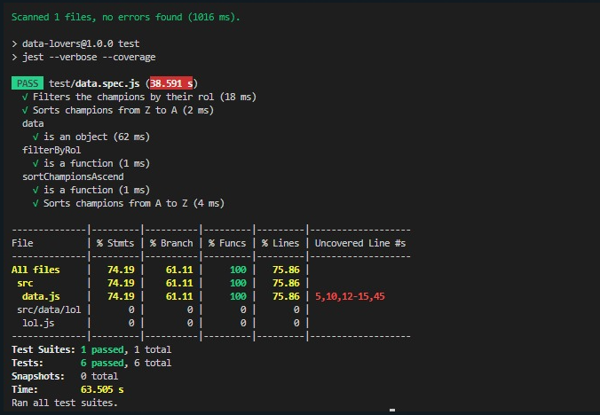

# Data Lovers

## Índice

* [1. Resumen del proyecto](#1-resumen-del-proyecto)
* [2. Prototipos](#2-prototipos)
* [3. Historias de Usuario](#3-historias-de-usuario)
* [4. Pruebas unitarias](#4-Pruebas-unitarias)

***

## 1. Resumen del proyecto.

Este proyecto está diseñado para jugadores de League of Legends con el fin de conocer los roles de personajes y las distintas dificultades que existen para escoger un nuevo campeón que dominar o el que mejor se adapte a sus necesidades al jugar en equipo. 
Para esto se escogió filtrar a los campeones por su rol y su dificultad, enlazando ambas opciones para mayor comodidad del usuario.

 
## 2. Prototipos.

Procesos de creación de prototipo de baja fidelidad:
 Se pensó que al momento de entrar a la página pudieran visualizarse todos los campeones y su nombre en una barra debajo de la imagen de personaje y junto al nombre su respectivo rol o roles.

 

 

 Proceso de creación de prototipo de alta fidelidad:
 Con base en los prototipos de baja fidelidad se construyó un prototipo de alta fidelidad en figma pensando en cómo seria nuestro proyecto finalizado, empezando por la visualización de los personajes, su respectivo nombre y los filtros por rol, dificultad y un ordenado alfabético 

## 3. Historias de usuario.
* HU 1: HU 1: Yo como jugador de LoL quiero utilizar esta página para conocer a los campeones del juego y decidir cual queda mejor.
* HU 2: Yo como jugador de LoL quiero poder filtrar a los personajes por rol para conocer los personajes que tiene el rol que seleccioné
* HU 3.Yo como jugador de lol quiero poder ordenar los personajes de la A - Z y de Z- A para visualizarlos por la inicial de su nombre
## 4. Pruebas unitarias.
Se redactaron y se ejecutaron pruebas unitarias para las funciones de filtrado y ordenamiento del sitio.

Visita el sitio a traves del link:[GitHubPages](https://elizabethochoa2000.github.io/CDMX013-data-loverss/src/)
